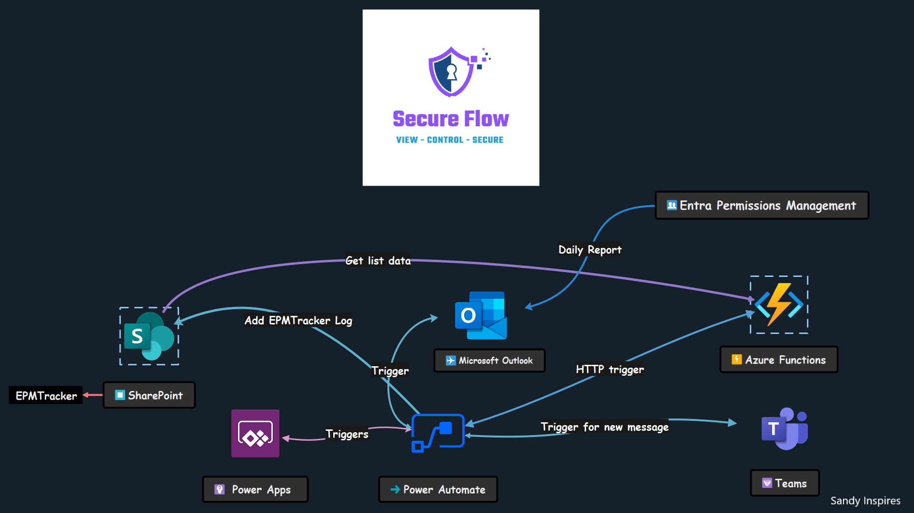
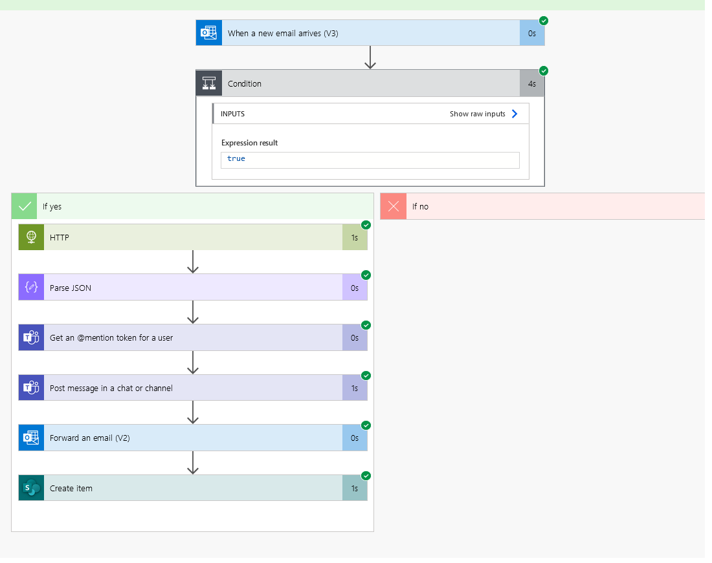
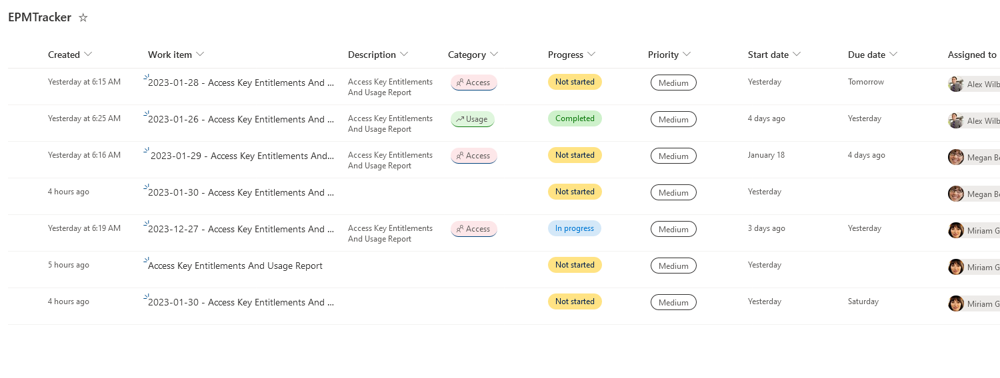
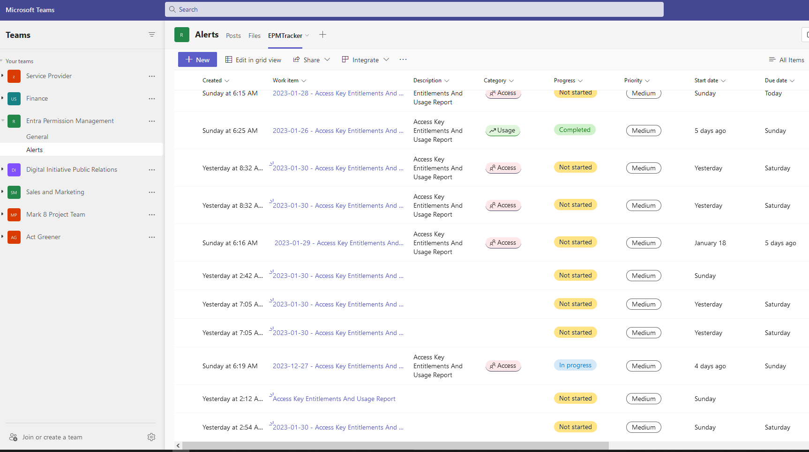
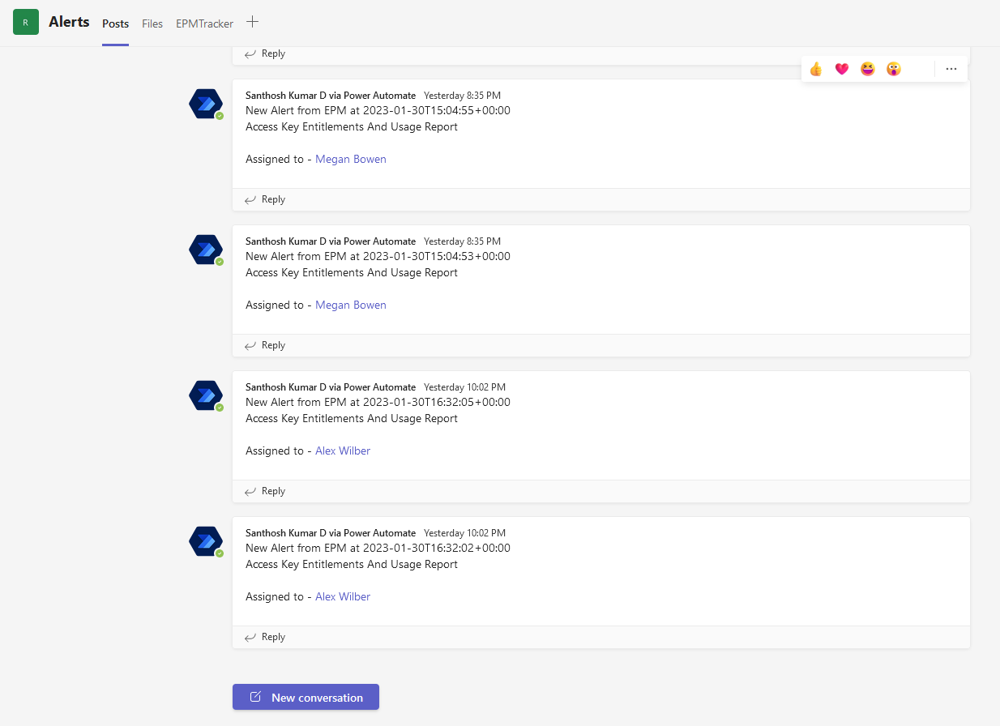

# Secure Flow

## YouTube Demo Video 📺📺
### [Click here to watch the demo](https://www.youtube.com/watch?v=WWD2JrgJoss&ab_channel=LateNightCodewithSanthosh)

## Setup environment variable
#### Please set the below variables
- MSFT_CLIENT_ID - Microsoft Azure Active Directory Client ID
- MSFT_CLIENT_SECRET - Microsoft Azure Active Directory Client Secret
- TENANT_ID - Microsoft Account Tenant ID
- SITE_ID - SharePoint Site ID you wish to connect to
- LIST_ID - SharePoint List ID you wish to connect to

## Architecture Diagram

## Power Automate Flow View 

## SharePoint View

## Teams Channel List View

## Teams Channel Message View

